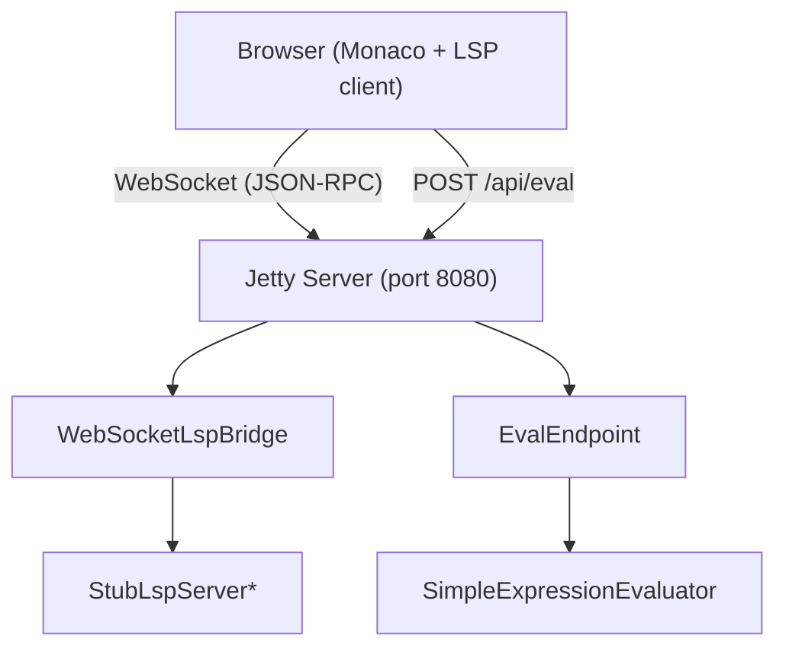

# TinyExpression IDE

Web-based IDE for TinyExpression formulas, built with Monaco Editor and LSP over WebSocket.

## Features (MVP)

- **Monaco Editor** with TinyExpression syntax highlighting (keywords, variables, operators, strings, comments)
- **LSP over WebSocket** providing completion, diagnostics, and hover information
- **Real-time evaluation** with variable substitution and debounced preview
- **Variable auto-detection** from `$variableName` references in the formula
- **Token railroad display** showing the structural breakdown of formulas
- **Split-pane layout** with resizable editor (left) and preview panel (right)

## Architecture



*The StubLspServer will be replaced by TinyExpressionP4LanguageServerExt once wired as a dependency.

## Prerequisites

- Java 21+
- Maven 3.9+
- The `unlaxer-common` and `unlaxer-dsl` artifacts installed in local Maven repository

## Build

```bash
mvn compile
```

## Run

```bash
mvn exec:java -Dexec.mainClass=org.unlaxer.tinyexpression.ide.IdeMain
```

Or build and run the JAR:

```bash
mvn package -DskipTests
java -cp "target/classes:$(mvn dependency:build-classpath -q -DincludeScope=runtime -Dmdep.outputFile=/dev/stdout)" \
     org.unlaxer.tinyexpression.ide.IdeMain
```

Then open http://localhost:8080 in a browser.

### Custom port

```bash
java -cp ... org.unlaxer.tinyexpression.ide.IdeMain 9090
```

## API

### POST /api/eval

Evaluate a TinyExpression formula.

**Request:**
```json
{
  "formula": "1 + $x * 2",
  "variables": { "x": "10" },
  "resultType": "number"
}
```

**Response:**
```json
{
  "result": "21",
  "error": null,
  "formula": "1 + $x * 2",
  "substituted": "1 + 10 * 2"
}
```

### WebSocket /lsp

LSP 3.17 protocol over WebSocket. Each message is a JSON-RPC payload (no Content-Length framing on the WebSocket layer).

## Project Structure

```
src/main/java/org/unlaxer/tinyexpression/ide/
  IdeMain.java                  - Entry point, Jetty server setup
  WebSocketLspBridge.java       - WebSocket <-> LSP stdio bridge
  StubLspServer.java            - MVP LSP server (keywords, diagnostics)
  EvalEndpoint.java             - REST evaluation endpoint
  SimpleExpressionEvaluator.java - Basic arithmetic evaluator (MVP stopgap)

src/main/resources/static/
  index.html                    - Single-page IDE (Monaco + preview panels)
```

## Roadmap

1. Wire in TinyExpressionP4LanguageServerExt for full LSP features
2. Wire in AstEvaluatorCalculator for full expression evaluation
3. Match expression folding UI
4. FormulaInfo metadata form editor
5. Dependency graph visualization (D3.js)
6. Electron/Tauri desktop packaging

## MCP

This server is an MCP (Model Context Protocol) backend for the volta facade.

- **Namespace**: `tinyexpression-ide`
- **Tools**: `evaluate`, `validate` (see `tinyexpression-ide://spec` for details)
- **Resources**: `tinyexpression-ide://spec`, `tinyexpression-ide://guide`, `skill://formula-eval-workflow`
- **Health**: `GET /healthz`
- **MCP endpoint**: `POST /mcp` (Streamable HTTP, JSON-RPC 2.0)

### Run with MCP

```bash
PORT=9264 java -cp ... org.unlaxer.tinyexpression.ide.IdeMain
```

The server listens on `0.0.0.0:$PORT` and serves:
- `/` — Monaco Editor IDE
- `/api/eval` — REST evaluation API
- `/lsp` — WebSocket LSP
- `/healthz` — health check (200 `{ok, name, version}`)
- `/mcp` — MCP Streamable HTTP endpoint

### volta participation

Registered as `tinyexpression-ide` in volta with hostname `expr.unlaxer.org`, port 9264.
See `volta.service.json` and `docs/mcp/DESIGN.md` for details.
