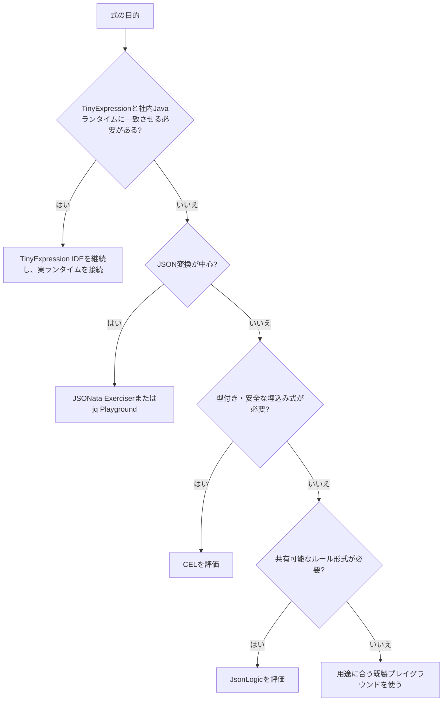

# TinyExpression IDE 市場調査

## 0. 要約

立ち位置: TinyExpression固有の構文・LSP・評価を一画面で確認できる自社DSL向け開発基盤である。

最大の弱点: 現状は StubLspServer と簡易評価器が中心で、製品の中核である「実際の言語仕様と同じ診断・評価」をまだ保証できない。

次の一手: まず実ランタイム／LSPを接続し、入力例・期待結果・エラー位置を保存して再現できる最小の検証ワークフローを作る。

## 1. このrepoは何か

一言でいうと、TinyExpression式をブラウザ上で編集し、変数を差し込み、結果と診断を即時確認するローカルWeb IDEである。READMEと実装を合わせると、Monaco Editor、WebSocket上のLSP、`POST /api/eval` の評価API、変数自動検出、分割ペイン、構造表示を一体で提供する。

提供価値は、TinyExpressionを使う開発者が、式をコードに埋め込んでから別途実行する手間を減らし、入力式・変数・結果・構文エラーを同じ画面で反復確認できることにある。したがって比較単位はMonacoのような部品ではなく、「DSLの式を作成し、サンプル入力で検証する開発者向けワークフロー」全体とした。

想定利用者は、TinyExpressionを組み込むJava開発者と、式を調整・レビューする社内利用者である。公開SaaSとしての提供は確認できず、現状はJava 21とMavenを前提にローカルJettyを起動する自社用基盤と判断する（推測）。

到達点の客観指標は、Java 5ファイルとHTML 1ファイル、実装1,590行、テストソース0件である。依存にはLSP4J、Jetty、Gson、社内の`unlaxer-common`／`unlaxer-dsl`がある。`mvn dependency:tree` はローカルMavenリポジトリの読み取り専用エラーで完走できず、実行テストの成功数は分からない。評価器の実体はコメントにもある通りMVP用の簡易実装で、完全なAstEvaluatorCalculatorは未接続である。

## 1.5 調査の型

`internal`。これは市場で単独製品として勝つためのライブラリ比較ではなく、「自作を続ける価値があるか、既製の式プレイグラウンドや別DSLに寄せられるか」を判断する調査である。既製品にはJSONata、CEL、JsonLogic、jqのような式・ルールの実行環境とプレイグラウンドがあるが、TinyExpression固有の文法・社内ランタイム・LSP接続をそのまま置き換えるものではない。

## 2. 比較対象と選定理由

| 製品 | 何ができるか | 採用状況 | ライセンス | うちとの決定的な違い | なぜ比較対象に選んだか |
|---|---|---|---|---|---|
| JSONata Exerciser | JSON入力とJSONata式を左右に置き、結果を試す公式プレイグラウンド。ローカル起動も可能 | GitHub 32 stars / 44 commits。最終更新日は画面で特定できず、分からない（2026-07-31確認） | MIT | JSON変換が主目的。TinyExpressionの型・LSP・業務変数モデルは持たない | 入力と式と結果を即時に試す、最も近い小さな代替 |
| CEL | 型付き・安全・非チューリング完全な式言語。公式サイトと複数言語実装、APIリファレンスを持つ | `google/cel-spec` 3.8k stars / v0.25.2は2026-05-08。2026-06-16に移転予定との告知あり | Apache-2.0 | 式の移植性・型検査・埋め込みを標準化するエコシステムで、単一のTinyExpression IDEではない | 「自作DSLを続けるか、標準式言語へ寄せるか」の判断軸になる最大の代替候補 |
| JsonLogic Playground | JSON形式のルールとデータをブラウザで評価。複数言語実装との共有を重視 | `json-logic-js` 1.5k stars / 104 commits。最終更新日は画面で特定できず、分からない（2026-07-31確認） | MIT | テキストIDEではなく、シリアライズ可能なJSONルールが中心。入力支援は限定的 | ルールを保存・共有・複数言語で再実行する場合の代替 |
| jq Playground | jqクエリとJSONをブラウザ内のWebAssemblyで実行。共有時だけスニペットを送る | `jqlang/playground` 843 stars / 257 commits。最終更新日は画面で特定できず、分からない（2026-07-31確認） | MIT | JSON変換に特化し、ブラウザ内実行と共有URLが強い。LSP型の業務DSL支援は目的外 | データを入力してクエリを試し、プライバシーを保ったまま共有する体験の比較対象 |

この地図は、TinyExpressionと完全互換の製品がある市場ではなく、用途別の式言語がそれぞれプレイグラウンドを持つ市場である。JSONataとjqはデータ変換、JsonLogicは共有可能なルール、CELは型付き埋め込みを軸にしている。したがってTinyExpressionが一般用途の式言語として競争するのは不利で、社内ランタイムと一体化した診断・評価体験に自作の理由を限定するのが妥当だと思う。

## 3. ポジショニング

数値で裏付けられる採用状況は確認できたが、各プレイグラウンドの利用者数や実行性能を同じ条件で取得できなかったため、推測の2軸図は作成しない。

## 4. 機能比較

| 機能 | 重み | うち | JSONata Exerciser | CEL | JsonLogic Playground | jq Playground |
|---|---|---|---|---|---|---|
| TinyExpressionの文法・ランタイムに一致 | ◎必須 | △（MVPは簡易実装、実ランタイム未接続） | × | × | × | × |
| 式の入力と即時結果表示 | ◎必須 | ○ | ○ | △（公式API／例はあるが同一UIは確認できず） | ○ |
| 変数・入力データを編集して再実行 | ◎必須 | ○（変数自動検出） | ○（JSON入力） | ○（型付きactivationを前提） | ○（rule/data分離） | ○（JSON入力） |
| 構文エラーを位置付きで表示 | ◎必須 | △（括弧中心のStub診断） | △（実行エラー中心） | ○（型・構文検査が言語設計の中心） | ×〜△（実装依存） | ○（位置付きエラーを公式実装が説明） |
| 補完・ホバー | ○効く | △（Stubのキーワード補完・ホバー） | × | △（周辺ツール／VS Code拡張は存在） | × | × |
| AST／構造を可視化 | ○効く | △（簡易railroad表示） | × | ○（ASTを仕様上の構成要素として扱う） | × | × |
| ブラウザだけで実行・データを外部送信しない | ○効く | ×（Javaサーバ起動が必要） | △（ローカル起動可能。公開サイトの実行方式は未確認） | △（公式サイトの方式は未確認） | ○（ブラウザで試せる） | ○（WebAssemblyでローカル処理） |
| 結果をURL等で共有 | △あれば | × | ×（READMEで確認できず） | △（仕様・サンプルはあるがプレイグラウンド共有は未確認） | △（公式playは確認できるが保存機能は未確認） | ○（共有時にスニペットURLを生成） |
| 社内Javaアプリへの組込み | ◎必須 | ○（Java/Jetty前提） | △（Java実装は別プロジェクト） | ○（Java実装が公式APIリファレンスに掲載） | △（Java実装あり） | ×〜△（Go実装中心） |

この表で痛い×は、共有性よりも最上段の「実際に使うTinyExpressionと同じ意味で評価できるか」である。ここが△のままだと、IDEの見た目が整っていても検証結果を信頼できない。逆にMonaco、分割ペイン、即時結果は競合も持つため、それだけでは差別化にならない。CELの型検査とjqのブラウザ内実行・共有は、今後の採用判断で特に学ぶ価値があるが、そのまま機能追加するのではなくTinyExpressionの実運用に必要かで選別すべきである。

## 5.5 調査者の見立て

本当の勝負所は機能数ではなく、「式を変更した直後の診断・評価結果が、本番で使うTinyExpressionと一致すること」だと読む。ここが保証されれば、汎用プレイグラウンドにない社内DSL固有の価値になる。

数字に出ていない懸念は、現状のStubLspServerとSimpleExpressionEvaluatorの二重実装である。仕様変更時にエディタ表示と本番評価がずれるリスクがあり、テストが見当たらないことも継続コストを増やす（コード確認に基づく見立て）。

自分なら、まず完成度の高い汎用IDEを目指さず、実ランタイムを唯一の評価源にして「入力例を保存し、期待結果と診断を再現できるTinyExpression Workbench」にする。

この見立てが外れるのは、利用者がTinyExpressionを直接編集するより、非開発者向けのGUIルール作成や共有URLを強く求める場合である。その場合は、現在の開発者向けIDEを伸ばすよりJsonLogic／CEL系の既製形式へ寄せる方が合理的になる。

## 6. 提案（優先順）

| 順 | 提案 | 分類 | 根拠 | 最小の一手 | 効きそうな指標 |
|---:|---|---|---|---|---|
| 1 | 実ランタイムとLSPを接続し、Stub評価器を単一の評価源に置き換える | 埋める | 必須機能が現状△。READMEのロードマップと実装コメントにも未接続が明記 | `TinyExpressionP4LanguageServerExt`／`AstEvaluatorCalculator`接続と、代表式10本の同値テストを追加 | 本番ランタイムとの一致率、診断の誤検知・見逃し数 |
| 2 | 式・変数・期待結果・実結果・診断を1ケースとして保存／再実行できる | 伸ばす | 即時評価と変数自動検出は既存の強み。比較対象の共有・再実行体験から得られる改善 | JSON形式のケース入出力と「Run all」相当の最小UIを追加 | ケース再実行時間、再現可能な不具合数、保存ケース数 |
| 3 | 型付き変数スキーマと、補完・ホバーに型／説明を出す | 埋める | CELが型と拡張を採用判断にする。現状はキーワード中心のStub支援 | `FormulaInfo`または変数定義JSONを受け、未定義変数と型不一致を診断 | 型エラーの早期検出率、補完利用率 |
| 4 | ブラウザ単体実行や一般用途の共有SaaS化は当面やらない | やらない | jq／JsonLogic等が既にブラウザ実行・共有で強く、TinyExpressionの自社ランタイム差別化を薄める | 共有が必要なケースだけファイル／URL化の要否を利用者に確認してから着手 | 保留した工数、共有要求の件数、実ランタイム一致への投資時間 |

提案1と2が順序を決める土台で、3はその後に初めて効く。4をやらないことで、既製プレイグラウンドとの機能数競争を避け、社内DSLの正確性に投資を集中できる。もし利用者調査で共有URLが主要要件だと判明した場合だけ、4の判断を見直す。

## 7. 選択の分岐

## 8. 出典

| URL | 参照日 | 何の根拠に使ったか |
|---|---|---|
| https://github.com/opaopa6969/tinyexpression-ide/blob/b6ab82b0877da024c8a87c22d40afade34f54a18/README.md | 2026-07-31 | 自repoの目的、機能、構成、ロードマップ |
| https://github.com/opaopa6969/tinyexpression-ide/tree/b6ab82b0877da024c8a87c22d40afade34f54a18/src | 2026-07-31 | 自repoの実装、Stub LSP、簡易評価、API構成、行数確認の基点 |
| https://github.com/jsonata-js/jsonata-exerciser | 2026-07-31 | JSONata Exerciserの機能、ローカル起動、MIT、32 stars、44 commits |
| https://docs.jsonata.org/ | 2026-07-31 | JSONataの用途、公式Tryサイト、実装一覧 |
| https://cel.dev/ | 2026-07-31 | CELの安全性、速度、拡張性、用途 |
| https://github.com/google/cel-spec | 2026-07-31 | CELの仕様、Apache-2.0、3.8k stars、v0.25.2、移転告知 |
| https://github.com/jwadhams/json-logic-js | 2026-07-31 | JsonLogicのルール共有・実行、Playground案内、MIT、1.5k stars、104 commits |
| https://jsonlogic.com/play.html | 2026-07-31 | JsonLogicをブラウザで計算する公開Playgroundと対応言語 |
| https://play.jqlang.org/ | 2026-07-31 | jq Playgroundの操作面、MIT、ブラウザ内処理、共有時だけ送信する仕様 |
| https://github.com/jqlang/playground | 2026-07-31 | jq PlaygroundのNext.js構成、WASM、共有スニペット、MIT、843 stars、257 commits |
| https://github.com/cel-expr/cel-go | 2026-07-31 | CEL実装の型検査・エラー位置・AST／コンパイル／実行APIの説明 |

外部サイトのstars・commit数は2026-07-31の取得値であり、最終更新日が画面で確定できなかった対象は「分からない」とした。自repoのMaven実行はローカルキャッシュの読み取り専用エラーで完走しなかったため、テスト成功数や依存ツリーの実測値は主張していない。
